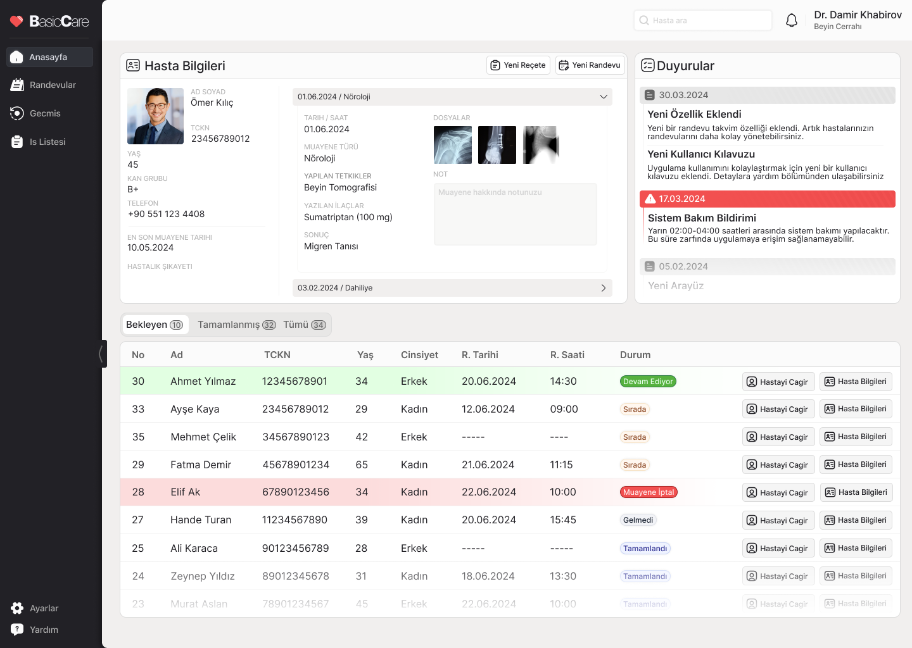
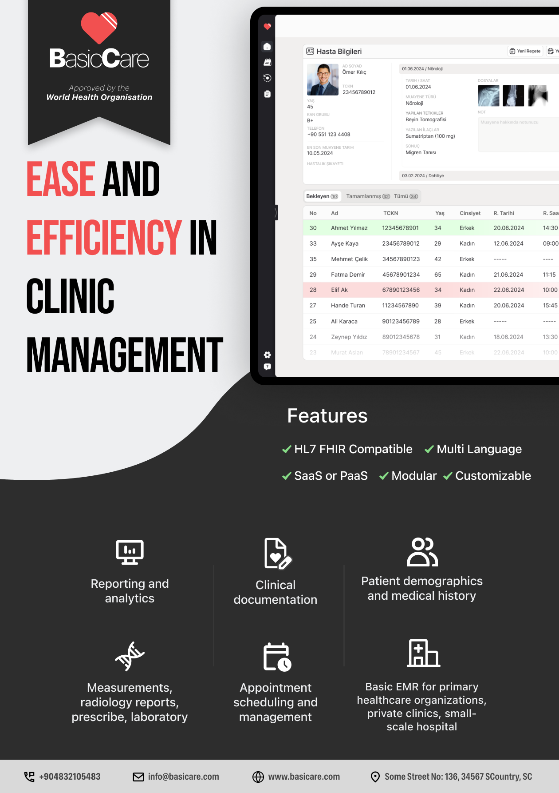

### BasiCare EMR uygulaması için konsept çalışması ve el ilanı tasarımı

**Kullandığım Teknolojiler**

- Next.js
- Tailwind
- shadcn/ui
- Figma


# **Ekran Görüntüleri 👇🏻** 

## ✨✨✨✨✨✨✨✨✨✨✨✨✨✨

## ✨✨✨✨✨✨✨✨✨✨✨✨✨✨

## ✨✨✨✨✨✨✨✨✨✨✨✨✨✨

Afiş ve El İlanı için Figma Linki: [Figma](https://www.figma.com/design/Xgt3JHi9NcHtn4hOjdOmrV/Electronic-Medical-Record?node-id=0-1&t=manHWg4hHQp4zL6R-1)

Uygulama çalışan hali: [BasiCare EMR](https://emr-system-nine.vercel.app)


**Kurulum**

```bash
pnpm install
pnpm dev
```

## ✅👉🏻👉🏻[Diğer çalışmalar için](https://github.com/imhalid/emr-system/tree/main/di%C4%9Fer-%C3%A7al%C4%B1%C5%9Fmalar) 
